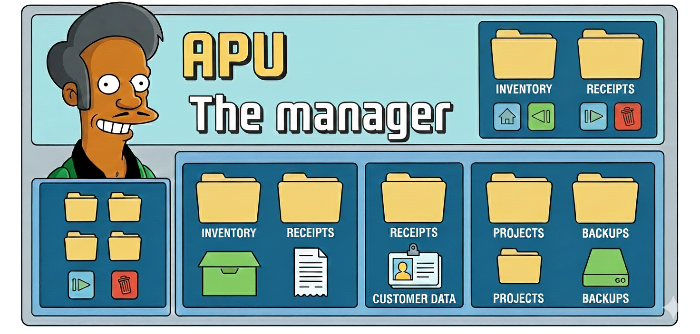

# Apu the Manager




## Descripción

**Apu the Manager** es una aplicación Flutter para gestionar FileSearchStores y Documents de la API de Gemini. Permite crear, listar, y eliminar stores y documentos, con soporte para paginación y logging configurable.

## Características

- ✅ Gestión de FileSearchStores (crear, listar, eliminar)
- ✅ Gestión de Documents (listar, subir, eliminar)
- ✅ Paginación de documentos (Load More)
- ✅ Logging configurable
- ✅ Configuración de API Key persistente
- ✅ Clean Architecture
- ✅ State management con Riverpod
- ✅ Manejo de errores con Either pattern

## Capturas de Pantalla

_(Agregar capturas aquí)_

## Requisitos

- Flutter SDK 3.10.0+
- Dart SDK 3.0.0+
- Gemini API Key ([Obtener aquí](https://aistudio.google.com/apikey))

## Instalación

### Prerequisitos del Sistema

#### Linux
Instalar `libsecret-1-dev`:
```bash
# Ubuntu/Debian
sudo apt-get install libsecret-1-dev

# Fedora/RHEL
sudo dnf install libsecret-devel

# Arch Linux
sudo pacman -S libsecret
```

Ver [docs/system-requirements.md](docs/system-requirements.md) para más detalles.

### Pasos de Instalación

1. **Clonar el repositorio:**
   ```bash
   git clone <repository-url>
   cd apu-the-manager
   ```

2. **Instalar dependencias:**
   ```bash
   flutter pub get
   ```

3. **Generar código:**
   ```bash
   dart run build_runner build --delete-conflicting-outputs
   ```

4. **Ejecutar:**
   ```bash
   flutter run
   ```

## Configuración

### API Key

1. Ejecutar la aplicación
2. Ir a **Configuración** (ícono ⚙️ en la esquina superior derecha)
3. Ingresar tu Gemini API Key en el campo correspondiente
4. Presionar el botón **Guardar**

La API key se almacena de forma **segura** en el dispositivo usando:
- **Linux**: libsecret
- **macOS**: Keychain
- **Windows**: Credential Manager

> **Nota de Seguridad:** La API key nunca se almacena en texto plano. Se utiliza el almacenamiento seguro nativo del sistema operativo.

### Logging

En Settings, puedes habilitar/deshabilitar el logging. Los logs aparecen en la consola durante el desarrollo.

## Uso

### Gestionar Stores

1. **Ver stores:** La pantalla principal muestra todos tus FileSearchStores
2. **Crear store:** Tap en el botón ➕ y proporciona un nombre
3. **Eliminar store:** Desliza o tap en el ícono 🗑️

### Gestionar Documents

1. **Ver documentos:** Tap en un store para ver sus documentos
2. **Subir documento:** Tap en el botón 📤 y selecciona un archivo
3. **Eliminar documento:** Tap en el ícono 🗑️ junto al documento
4. **Cargar más:** Tap en "Load More" al final de la lista

## Estructura del Proyecto

```
lib/
├── core/              # Funcionalidades compartidas
├── data/              # Capa de datos (models, datasources, repos)
├── domain/            # Capa de dominio (entities, interfaces)
└── presentation/      # Capa de presentación (UI, providers)

test/
├── data/              # Tests de la capa de datos
└── helpers/           # Mocks y helpers

docs/
├── api-file-search-stores.md  # Documentación API Stores
├── api-documents.md           # Documentación API Documents
├── architecture.md            # Arquitectura de la app
└── development-guide.md       # Guía de desarrollo
```

## Comandos Útiles

```bash
# Generar código
dart run build_runner build --delete-conflicting-outputs

# Watch mode
dart run build_runner watch

# Tests
flutter test

# Análisis
flutter analyze

## Roadmap

### v1.0 (Actual)
- [x] CRUD de FileSearchStores
- [x] CRUD de Documents
- [x] Paginación
- [x] Logging
- [x] Settings persistentes

### v1.1 (Próximo)
- [ ] Soporte para CustomMetadata
- [ ] Búsqueda y filtros
- [ ] Infinite scroll automático
- [ ] Pull-to-refresh
- [ ] Retry logic para errores

### v2.0 (Futuro)
- [ ] Offline support con cache
- [ ] Sincronización en background
- [ ] Gestión de Chunks
- [ ] Búsqueda semántica
- [ ] Integración con chat

## Contribuir

Las contribuciones son bienvenidas. Por favor:

1. Fork el proyecto
2. Crea una branch (`git checkout -b feature/nueva-funcionalidad`)
3. Commit tus cambios (`git commit -m 'feat: agregar nueva funcionalidad'`)
4. Push a la branch (`git push origin feature/nueva-funcionalidad`)
5. Abre un Pull Request

Ver [development-guide.md](docs/development-guide.md) para más detalles.

## Licencia

[MIT License](LICENSE)

## Contacto

- **Autor:** [Tu Nombre]
- **Email:** [tu@email.com]
- **GitHub:** [tu-usuario]

## Agradecimientos

- [Gemini API](https://ai.google.dev/gemini-api/docs)
- [Flutter](https://flutter.dev)
- [Riverpod](https://riverpod.dev)
- Comunidad de Flutter

---

**Nota:** Esta aplicación requiere una API key válida de Gemini. Obtén la tuya en [Google AI Studio](https://aistudio.google.com/apikey).
